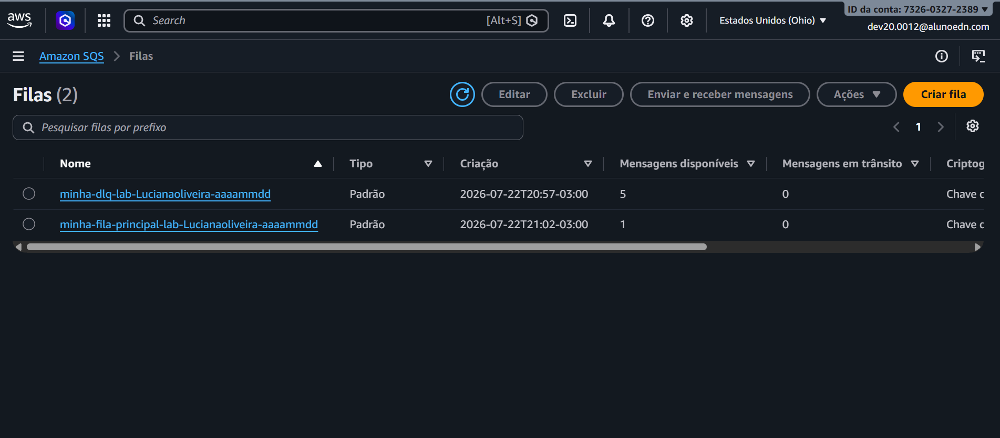
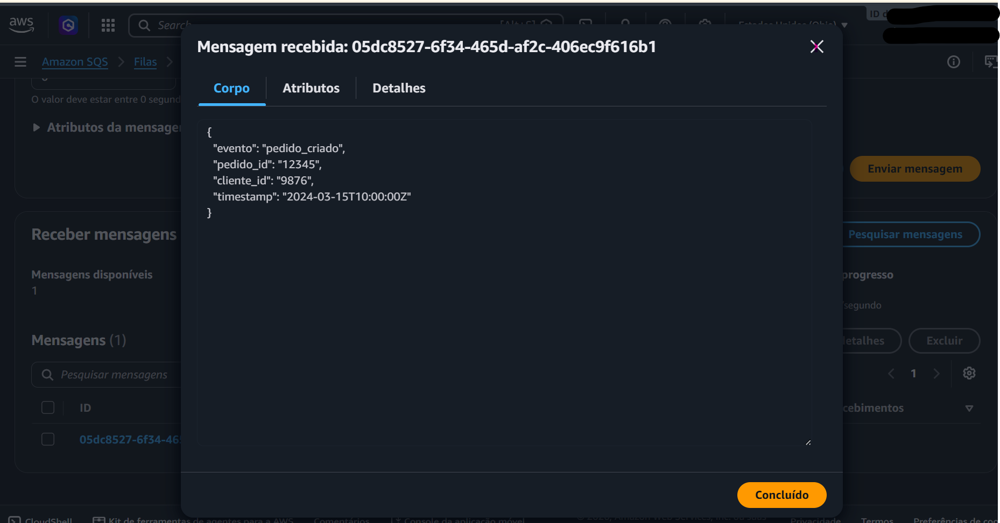

# AWS SNS + SQS + Dead Letter Queue (DLQ)

Laboratório prático desenvolvido durante meus estudos em AWS, explorando comunicação assíncrona utilizando Amazon SNS, Amazon SQS e Dead Letter Queue.

## Objetivo

Implementar uma arquitetura de mensageria onde o Amazon SNS realiza a publicação de mensagens, o Amazon SQS realiza o armazenamento e processamento, e a DLQ trata mensagens que não puderam ser processadas.

## Serviços utilizados

- Amazon SNS
- Amazon SQS
- Dead Letter Queue (DLQ)
- AWS Management Console

## Arquitetura

Publisher
|

Amazon SNS Topic
|

Amazon SQS Queue
|

Processamento da mensagem
|

Falhas
|

Dead Letter Queue (DLQ)

## Evidências do laboratório

### Filas SQS criadas

### Mensagem recebida

## Aprendizados

Neste laboratório pratiquei:

- Criação e configuração de filas SQS;
- Integração entre SNS e SQS;
- Envio e recebimento de mensagens;
- Conceito de Dead Letter Queue para tratamento de falhas;
- Fundamentos de arquiteturas desacopladas na AWS.
